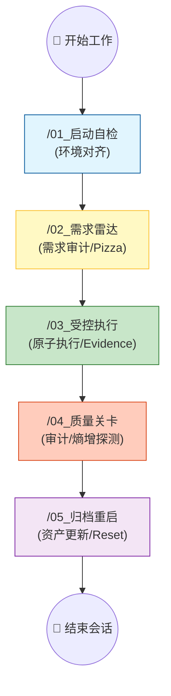

# 🏁 Sentinel-K 项目快速入门 (Standard Operating Procedure)

> **Sentinel-K**: 专为 AI 与人类高效协同设计的“协作操作系统”。

---

## 🏗️ 架构分层 (Project Layers)

1.  **🚀 自动化层 (Logic)**: `.agent/workflows/` (AI 执行指令集)
2.  **🧠 知识层 (Kernel)**: `Sentinel-K_内核/` (唯一权威口径与意图)
3.  **🏗️ 执行层 (Body)**: `工程名称/` (具体业务源代码)
4.  **🗄️ 归档层 (Archive)**: `docs/` (原型工厂与历史资产)

---

## 🚀 极简启动路径 (Getting Started)

针对小白新手，我们提供了 **“继承与注入”** 的极简路径：

### 场景 A：从 0 到 1 全新开发 (Greenfield)
| 步骤            | 操作类型   | 文件                                         | 目的                                                    |
| :-------------- | :--------- | :------------------------------------------- | :------------------------------------------------------ |
| **1. 注入灵魂** | **🔴 必选** | `Sentinel-K_内核/01_项目全景 (Landscape).md` | 告诉 AI 你的技术栈、业务目标和当前痛点。                |
| **2. 继承法则** | **🟢 默认** | `Sentinel-K_内核/00_系统总纲 (Kernel).md`    | **直接沿用**。遵循 `[K-PIZZA]`、`[K-LANG]` 等核心法则。 |
| **3. 细化规约** | **⚪ 可选** | `Sentinel-K_内核/02_开发规约 (Specs)/`       | 若有特定的命名或习惯需求，在此补充。                    |
| **4. 激活环境** | **⚡ 运行** | `/01_启动自检`                               | 依据 `[K-BOOT]` 加载 Pack，完成环境自检。               |

### 场景 B：基于 Base 工程二次开发 (Secondary Dev)
*   **重点更新**：完善 `01_项目全景` 中的“当前里程碑”以及“新增技术债”。
*   **知识固化**：在 `04_答疑库 (FAQ).md` 中记录 Base 工程的特定坑点，防止 AI 再次跌入。

---

## 🔄 开发协作流程图 (Workflow)

---

## 📚 内核文档协作指南

| 文档名称        | 锚点引用   | 人类 (指挥官)    | AI (执行官)               |
| :-------------- | :--------- | :--------------- | :------------------------ |
| **00_系统总纲** | `[K-TERM]` | 审核价值观/红线  | 严格遵守核心准则          |
| **01_项目全景** | -          | **更新业务蓝图** | 识别模块依赖与 Solid 资产 |
| **03_决策日志** | `[K-ADR]`  | 最终签字确认     | 起草 ADR 并申请评审       |
| **04_答疑库**   | -          | 提供疑难线索     | **自动沉淀技术见解**      |
| **05_项目进度** | -          | 划分大任务       | **实时反馈小步进度**      |

---

## 🛠️ 指挥官快速上手
1.  **唤醒 AI**: 直接对他念出指令（如：`运行 /01_启动自检`）。
2.  **看评分**: 关注 **Confidence Score Card**。依据 `[K-PIZZA]` 法则，复杂任务必须进行拆解。
