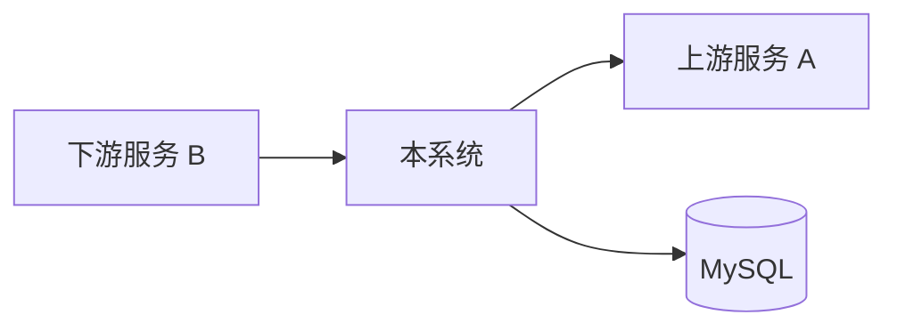

# 06_业务拓扑 (Topology)

> [!TIP]
> **用途**: 描述项目的业务边界、上下游依赖关系、以及组织架构映射。

## 1. 系统依赖拓扑

## 2. 模块职责清单
- **Module A**: [功能描述]
- **Module B**: [功能描述]

## 3. 组织与干系人
- **指挥官**: [联系人/角色]
- **业务专家**: [联系人/角色]
