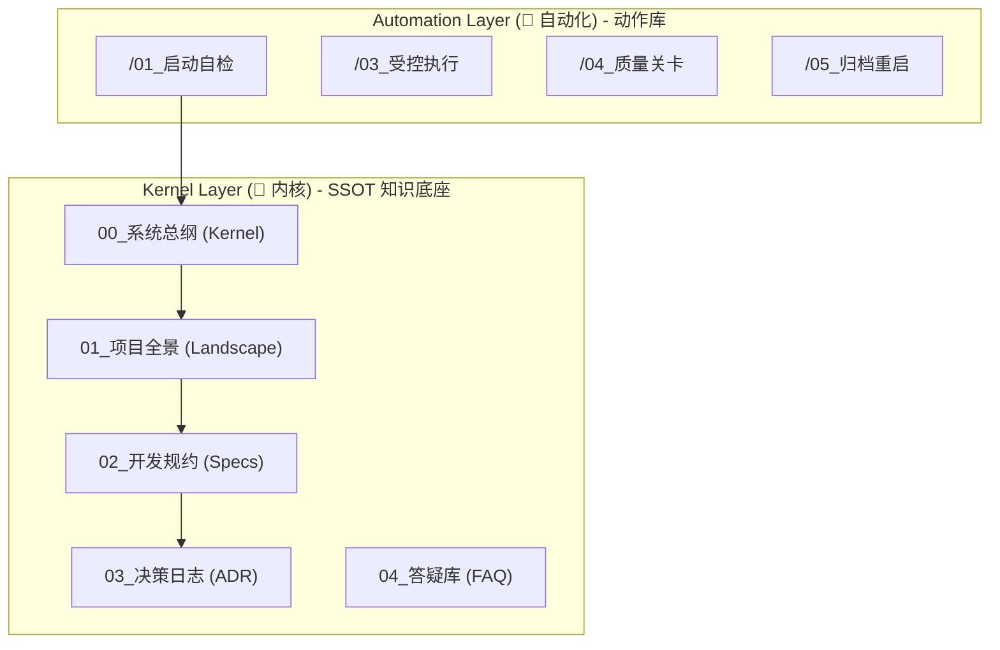

# 🗺️ Sentinel-K 通用内核地图 (Universal Kernel Map)

> **定位**: Sentinel-K "AI 协作操作系统" 的架构蓝图。

## 1. 核心架构层级 (Architecture Hierarchy)



## 2. 标准目录结构 (Standard Directory Layout)

```text
Project Root/
├── .agent/
│   └── workflows/                # 🚀 [自动化层] (Logic)
│
├── Sentinel-K_内核/                 # 🧠 [知识层] (Kernel - SSOT)
│   ├── 00_系统总纲 (Kernel).md      # 核心法则 (Constitution) `[K-TERM]`
│   ├── 01_项目全景 (Landscape).md   # 项目全景图 (领域模型)
│   ├── 02_开发规约 (Specs)/         # 前后端开发规范
│   ├── 03_决策日志 (ADR).md         # 架构决策记录 `[K-ADR]`
│   ├── 04_答疑库 (FAQ).md           # 知识沉淀与 Q&A
│   ├── 05_项目进度 (Tasks).md       # 任务进展与进度追踪
│   ├── 06_业务拓扑 (Topology).md    # 业务架构与组织关系
│   └── 内核地图.md                  # 本文档
│
├── 工程名称/                         # 🏗️ [执行层] (Body)
└── docs/                            # 🗄️ [归档层] (Archive)
    └── prototypes/                  # 原型工场
```

## 3. 指令集指南

1. **/01_启动自检**: 依据 `[K-BOOT]` 加载上下文，完成人格对齐。
2. **/02_需求雷达**: 启动需求审计，触发 `[K-PIZZA]` 判定。
3. **/03_受控执行**: 依据 `[K-LANG]` 与 `[K-TEST]` 执行，交付 `[K-EVIDENCE]` 证据块。
4. **/04_质量关卡**: 熵增探测，验证准则闭环。
5. **/05_归档重启**: 同步 `[K-ADR]` 与进度，重置 Pack-0。

---
> *更新于: 2026-02-16 - SSOT 路径统一化*
